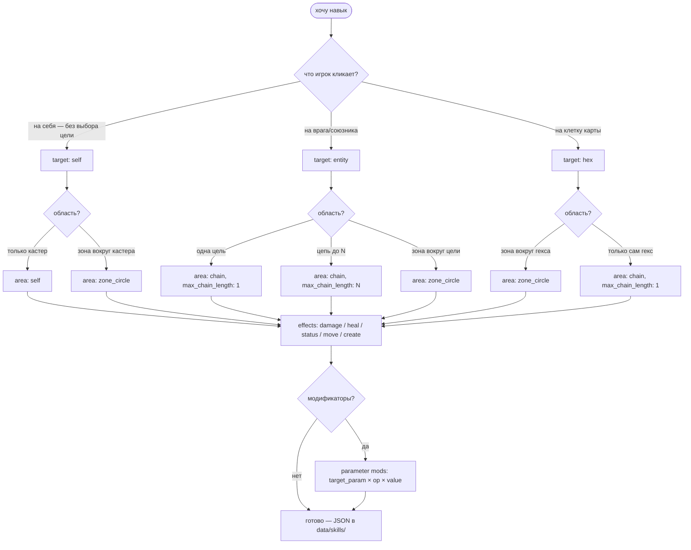

# 007-skill-system — архитектура (as-built)

**Spec:** [`spec.md`](./spec.md) · **Plan:** [`plan.md`](./plan.md) · **Tasks:** [`tasks.md`](./tasks.md)

Документ как реально собрано. Обновлять после изменений в системе.

---

## 1. Слои композиции

```
Skill                                         data/skills/*.json
├── id: StringName
├── cooldown: int                             — глобальный CD навыка
├── _cd_remaining: int                        — runtime, не в JSON
└── abilities: Array[Ability]                 — упорядоченно, исполняются по очереди
       │
       Ability                                — одна "способность" внутри навыка
       ├── id: StringName
       ├── target:  AbilityTarget             — ОДНА primary-цель (Variant)
       ├── area:    AbilityArea               — primary → Array[victim]
       ├── effects: Array[AbilityEffect]      — что применить к каждой жертве
       └── modifiers: Array[ParameterModifier] — параметр-мутаторы (на ability и effect)
              │
              ├── AbilityTarget — категория цели (что игрок кликает)
              │     SelfTarget       → caster
              │     EntityTarget     → Actor по ctx.target_id, +range
              │     HexTarget        → Vector2i по ctx.target_coord, +range
              │     DirectionTarget  — P2 stub
              │     ObjectTarget     — P3 stub
              │
              ├── AbilityArea — primary развёрнутое в Array жертв (nearest→farthest)
              │     SelfArea         → [caster], игнорирует primary
              │     ChainArea        → BFS-цепь до max_chain_length
              │     ZoneCircleArea   → BFS-круг радиуса radius
              │     ZoneLine/Cone/Arc — P2/P3 stubs
              │
              ├── AbilityEffect — что делается с одной жертвой
              │     DamageEffect     → take_damage(damage + caster_bonus)
              │     HealEffect       → heal(amount)
              │     StatusEffect     → add_status(id, duration)
              │     MoveEffect       → push/pull/teleport
              │     CreateEffect     → спавн на ctx.target_coord (stub)
              │
              └── ParameterModifier — мутатор: target_param × op × value
                    op="add" | "mul"
                    Формула: final = (base + Σadds) × Π muls   (per-param, коммутативна)
```

**Симметрия игрок ↔ враг (Pillar 1.5.2):** один и тот же контракт — игрок и манекен в godmode оба используют `Skill.cast(actor, ctx)`. Манекен через `attack_skill_id` тянет skill из `SkillDatabase`. AI — это просто другая функция выбора `ctx`.

---

## 2. Жизненный цикл каста

```
Skill.cast(caster, ctx):
  if not is_ready(): return false
  for ability in abilities:                    # каждая резолвит цели ЗАНОВО
    ability.cast(caster, ctx)                  # → может вернуть false (no targets)
  _cd_remaining = cooldown
  emit EventBus.skill_cast


Ability.cast(caster, ctx):
  primary = target.resolve(caster, ctx)        # Variant: Actor | Vector2i | null
  if primary == null: return false

  eff_area = area.duplicate()                  # защита от мутации общего ресурса
  apply_param_mods(eff_area, modifiers)        # модификаторы могут менять radius/max_chain_length

  victims = eff_area.resolve(caster, primary, ctx)   # Array[Actor] (или Array[Vector2i] для P2)

  if primary == caster:                        # SelfTarget → исключаем кастера из зоны
    victims = victims.filter(v => v != caster)

  for victim in victims:
    for base_eff in effects:
      eff_dup = base_eff.duplicate()
      apply_param_mods(eff_dup, modifiers)     # модификаторы могут менять damage/duration/...
      if eff_dup.requires_alive_target and is_dead(victim): continue
      eff_dup.apply(caster, victim, ctx)
  emit EventBus.ability_cast
```

**Ключевые свойства:**
- Цели каждой ability резолвятся ЗАНОВО на момент её исполнения. Это даёт вампиризм: ability1=damage добивает врага, ability2=self-heal лечит кастера независимо от смерти жертвы.
- `Resource.duplicate()` shallow-copy — достаточно для наших effect/area, у них только примитивные `@export`-поля.
- Модификаторы применяются к ability ИЛИ к конкретному effect: они затрагивают любое `@export`-поле, имя которого совпадает с `target_param`.

---

## 3. Загрузка JSON → Resource

```
[startup]
  ├── AbilityDatabase._ready()  → сканит data/abilities/*.json (сейчас пусто, .gitkeep)
  └── SkillDatabase._ready()    → сканит data/skills/*.json
         для каждого skill JSON:
           для каждого ability в skill:
             ab = AbilityDatabase.build_ability_from_dict(ab_data)
             skill.abilities.append(ab)
             AbilityDatabase.register_ability(ab)   ← embedded ability видна по ID
```

**Почему `build_ability_from_dict` публичный (без `_`):** SkillDatabase использует его для парсинга embedded abilities. Andrey использует тот же путь. (Имя нормализовано в 016 — был `_build_ability_from_dict`, см. F-030.)

**Регистрация в AbilityDatabase нужна для:** `MoveRangeOverlay` (enemy path, использует ID), `ActorInspector` (тултипы по ID). Для слотов игрока overlay получает Ability-объекты напрямую от skill — lookup по ID не нужен.

---

## 4. Контракт `ctx` Dictionary

| Ключ | Тип | Кто пишет | Кто читает |
|---|---|---|---|
| `registry` | `ActorRegistry` | controller | EntityTarget, ChainArea, ZoneCircleArea |
| `grid` | `HexGrid` | controller | все area, все move/create effects, EntityTarget/HexTarget при range-check |
| `target_id` | `StringName` | controller (из `grid.get_actor_at(coord_under_mouse)`) | EntityTarget |
| `target_coord` | `Vector2i` | controller (из `grid.coord_under_mouse()`) | HexTarget, MoveEffect (teleport), CreateEffect |

`ctx` строится один раз в каждом колл-сайте (`_update_castability`, `_handle_lmb`, `_cast_slot`, enemy AI). Передаётся как иммутабельная сводка состояния мира на момент клика.

---

## 5. EventBus

```gdscript
signal ability_cast(caster_id, ability_id, target_ids: Array)   # каждая ability в Skill
signal skill_cast(caster_id, skill_id, target_ids: Array)       # один раз на навык
```

Подписчики (текущие): `_telegraph_hexes` логика реактивит на `actor_died`. UI cooldown-индикаторы — задел под `skill_cast`, ещё не реализованы.

---

## 6. UI — godmode

| Компонент | Файл | Роль |
|---|---|---|
| SlotBar | `scripts/presentation/slot_bar.gd` | 4 слота Q/W/E/R, хранит Skill-объекты, RMB → picker |
| GodmodeController | `scripts/presentation/godmode/godmode_controller.gd` | input, ctx-сборка, cast pipeline, hover-preview |
| MoveRangeOverlay | `scripts/presentation/godmode/move_range_overlay.gd` | move-range (синий), attack-range (оранж), zone preview (фиолет) |
| ActorInspector | `scripts/presentation/godmode/actor_inspector.gd` | HP/abilities панель |

**RMB на слоте** → `PopupMenu` со всеми ID из `SkillDatabase`, выбор → `set_slot(slot, skill)`.
**F6** → debug-каст `test_vamp_strike` на ближайшего врага.
**Зональная подсветка** обновляется каждый кадр в `_update_castability` через `area.get_affected_hexes(caster_coord, hover_coord, grid)`. Очищается автоматически когда нет активного слота.

---

## 7. Как добавить новый навык — recipe

### 7.1. Decision tree



### 7.2. Чеклист

1. **Уникальные ID.** Скилу, каждой ability внутри, каждому effect — глобально-уникальные ID. `AbilityDatabase` регистрирует embedded abilities last-write-wins, дубли молча затирают друг друга → overlay показывает чужую range. Префикс по навыку (`fb_dmg`, `fb_burn` для fireball) или по типу (`tas_dmg` для test_area_strike).
2. **Файл `data/skills/<id>.json`** по схеме (см. 7.3).
3. **Назначить на слот** — в godmode RMB по слоту → выбрать skill из списка. Или в `_seed_slots()` добавить `_slot_bar_node.set_slot(N, SkillDatabase.get_skill(&"my_skill"))`.
4. **F5 в godmode перезагружает `game_speed.cfg`**, но НЕ skill-JSONы. Скил-JSONы перечитываются только при перезапуске сцены.
5. **Тест** — кликнуть слот, навести на цель, проверить orange-overlay (range), фиолетовый-overlay (зона), preview-урон на HP-баре.

### 7.3. Схема JSON

```json
{
  "id": "<unique_skill_id>",
  "cooldown": 0,
  "abilities": [
    {
      "id": "<unique_ability_id>",
      "target": {"kind": "self|entity|hex", "range": -1},
      "area":   {"kind": "self|chain|zone_circle", "max_chain_length": 1, "radius": 1},
      "effects": [
        {"kind": "damage|heal|status|move|create",
         "id": "<unique_effect_id>",
         "type": "damage", "duration": 0, "requires_alive_target": true,
         "damage": 10}
      ],
      "modifiers": [
        {"kind": "parameter", "id": "<id>", "target_param": "damage", "op": "add", "value": 5}
      ]
    }
  ]
}
```

Поля `target` / `area` принимают только `kind` + параметры именно этого подкласса. Остальные молча игнорируются. Если поставить `range` на `target.kind=self` — ничего не сломается, но и не сработает.

### 7.4. Примеры

**Чистый damage в одну цель:**
```json
{ "target": {"kind": "entity", "range": 1},
  "area":   {"kind": "chain", "max_chain_length": 1},
  "effects": [{"kind": "damage", "damage": 8}] }
```

**Self-AoE (взрыв вокруг кастера, кастер не задет — фильтрует Ability.cast):**
```json
{ "target": {"kind": "self"},
  "area":   {"kind": "zone_circle", "radius": 2},
  "effects": [{"kind": "damage", "damage": 15}] }
```

**Targeted-AoE на гекс с радиусом 3, дальность каста 6 (кастер задет если попал в зону):**
```json
{ "target": {"kind": "hex", "range": 6},
  "area":   {"kind": "zone_circle", "radius": 3},
  "effects": [{"kind": "damage", "damage": 10}] }
```

**Цепь молнии до 3 целей с оглушением:**
```json
{ "target": {"kind": "entity", "range": -1},
  "area":   {"kind": "chain", "max_chain_length": 3},
  "effects": [{"kind": "damage", "damage": 10},
              {"kind": "status", "status": "stun", "duration": 1}] }
```

**Удар + откат:**
```json
{ "target": {"kind": "entity", "range": 1},
  "area":   {"kind": "chain", "max_chain_length": 1},
  "effects": [{"kind": "damage", "damage": 4},
              {"kind": "move", "move_type": "push", "move_distance": 2}] }
```

**Вампиризм через 2 ability в одном skill:**
```json
{ "abilities": [
    { "target": {"kind": "entity", "range": -1},
      "area": {"kind": "chain", "max_chain_length": 1},
      "effects": [{"kind": "damage", "damage": 100}] },
    { "target": {"kind": "self"},
      "area":   {"kind": "self"},
      "effects": [{"kind": "heal", "heal": 50}] }
] }
```
Цели резолвятся для каждой ability отдельно — heal сработает даже если первая ability убила цель.

---

## 8. Подводные камни (history of bugs)

| Симптом | Корень | Где починено |
|---|---|---|
| `vs_heal` не лечил кастера после убийства цели | `target=entity` резолвил мёртвого → `null` → cast bail-out до SelfArea | `SelfTarget` (всегда возвращает caster) |
| Зональный AoE не наносил урон при `target=hex` | ZoneCircleArea возвращал `Array[Vector2i]` в hex-mode, DamageEffect ждал Actor | ZoneCircleArea всегда возвращает Array[Actor], CreateEffect читает `ctx.target_coord` |
| Фиолетовая подсветка накапливалась при движении мыши | `_add_hex` проверял `target_array.is_empty()` — после `clear()` массив пустой, первый поли уходил в `_polys` | сентинел `null` вместо `is_empty()`, `free()` вместо `queue_free()` |
| `target=hex range=6` подсвечивал всё поле оранжем | дубль ID `vs_dmg` в двух skill JSONах → AbilityDatabase last-write-wins возвращал чужую ability с range=-1 | уникальные ID + overlay принимает Ability-объекты для слотов игрока |
| Out-of-range клик деселектил игрока | failed `can_apply` падал в `_inspect_hex` → `_selected = null` | при активном слоте LMB либо кастует, либо no-op |
| HexTarget overlay ≠ реальной зоны каста | `resolve()` через `find_path` (A* с move_cost), `get_range_hexes` через BFS-прыжки | оба через `reachable_within` (BFS) |

**Правило:** `get_range_hexes()` (рисует overlay) и `resolve()` (валидирует каст) должны использовать одну и ту же метрику дистанции. Любое расхождение = баг.

---

## 9. Что НЕ в этой системе

Out of scope намеренно (см. spec §"Out of scope"):
- Триггерные модификаторы (`freeze_on_hit`, `extra_cast`) — только параметр-мутаторы.
- Стоимость кроме CD (мана, AP).
- Прерывание навыка извне (стан кастера посреди каста).
- Реальная статус-система (`StatusEffect.apply` сейчас лог + no-op).
- Object-сущности (ящики, колонны).
- Сериализация CD в save.
- DoT / HoT (`duration > 0` пометить — пока работает как мгновенный).

Если что-то из этого станет нужно — отдельная фича (spec-009 или дальше).
